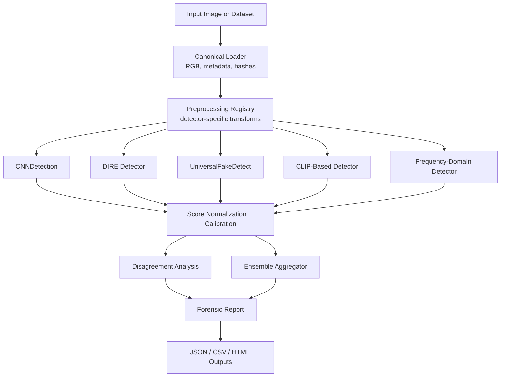

# AI Image Forensic Evaluation Framework

This document describes a research-oriented framework for benchmarking AI-image detectors, analyzing detector disagreement, and producing explainable forensic reports. It intentionally does **not** include image-cleaning, adversarial evasion, metadata spoofing, or detector-bypass workflows.

The pasted earlier approach is out of scope for this project because it contains detector-targeted perturbation, diffusion re-synthesis, Bayer simulation, and metadata injection. Those ideas are useful only as controlled benchmark degradations when applied to labeled copies inside an evaluation harness, not as a production image-transformation pipeline.

## Goals

- Evaluate multiple independent AI-image detectors on a shared input contract.
- Produce calibrated per-detector scores and a final ensemble confidence in `0-100`.
- Log intermediate artifacts for reproducibility, debugging, and explainability.
- Benchmark across generators, real-camera sources, image domains, and benign post-processing transforms.
- Support future detectors through a modular plugin-style architecture.

## Non-Goals

- Do not provide image modifications intended to reduce detector confidence.
- Do not spoof provenance, camera metadata, or acquisition history.
- Do not tune transformations on individual images to change a detector decision.
- Do not treat any detector score as ground truth without dataset-level validation.

## High-Level Pipeline



## Detector Result Contract

Every detector should return the same typed result, even if its internal model is very different.

```python
@dataclass
class DetectorResult:
    detector_id: str
    version: str
    raw_score: float | None
    calibrated_score: float | None  # P(fake), calibrated on validation data
    confidence_0_100: float | None
    label: Literal["real", "fake", "uncertain", "error"]
    threshold: float | None
    latency_ms: float
    device: str
    input_size: tuple[int, int]
    evidence: dict[str, Any]        # feature stats, maps, residuals, warnings
    error: str | None = None
```

Score convention: `0.0 = strong real-camera evidence`, `1.0 = strong AI-generated evidence`, and `None = detector failed or abstained`.

## Stage 1: CNNDetection

| Item | Recommendation |
| --- | --- |
| Purpose | General-purpose baseline detector for CNN/GAN-generated images, especially historical GAN families. |
| Forensic signals | Learned spatial artifacts, texture statistics, JPEG/blur-robust augmentation artifacts, generator fingerprints captured by a ResNet-style classifier. |
| Input | RGB image, usually resized/cropped to `224x224`; detector-specific ImageNet normalization. |
| Output | Raw logit or probability for fake class; convert to calibrated `P(fake)`. |
| Interpretation | High score means the image resembles synthesis artifacts learned by the CNNDetection training distribution; low score does not prove camera authenticity. |
| Strengths | Simple, fast, reproducible, strong baseline, easy batch inference. |
| Weaknesses | Older training distribution; weaker on newer diffusion, edited, highly compressed, or out-of-domain real images. |
| Failure modes | False negatives on modern diffusion images; false positives on unusual camera pipelines, heavy processing, low-quality web images, or non-photographic graphics. |
| Open source | Official `PeterWang512/CNNDetection` repository and weights. |
| GPU / memory | CPU feasible for small batches; GPU recommended for throughput. ResNet-50 inference is usually under 2 GB VRAM at moderate batch sizes. |
| Integration | Wrap as `CNNDetectionAdapter`; normalize single-logit and two-class checkpoints into the shared `DetectorResult`. |

Implementation notes:

- Preserve the model's native preprocessing; do not force one global resize/crop for all detectors.
- Log raw logits, pre-sigmoid values, selected checkpoint name, and image resize path.
- Treat published model outputs as **uncalibrated** unless calibrated on your validation split.

## Stage 2: DIRE Detector

| Item | Recommendation |
| --- | --- |
| Purpose | Diffusion-focused detector using reconstruction behavior from a pretrained diffusion model. |
| Forensic signals | Diffusion reconstruction error, residual maps between input and reconstructed image, local reconstruction consistency. |
| Input | RGB image prepared for the DIRE reconstruction model and classifier; often requires model-specific resizing and diffusion preprocessing. |
| Output | DIRE representation plus classifier score; convert to calibrated `P(fake)`. |
| Interpretation | High score means the image is more consistent with diffusion-generated reconstruction patterns. |
| Strengths | Strong conceptual independence from plain CNN classifiers; useful for diffusion-family analysis; can provide residual visual evidence. |
| Weaknesses | Heavy compute; official repo is archived; reconstruction settings strongly affect latency and reproducibility. |
| Failure modes | Unstable scores under mismatched resolution, aggressive compression, unknown domains, or images already processed by multiple tools. |
| Open source | Official `ZhendongWang6/DIRE` implementation, pretrained models, and DiffusionForensics references. |
| GPU / memory | GPU strongly recommended. Expect diffusion reconstruction to need roughly `8-16 GB` VRAM depending on resolution, batch size, precision, and reconstruction settings. |
| Integration | Run asynchronously or in a slower “full” profile; cache reconstructed images and residual maps by input hash. |

Implementation notes:

- Keep reconstruction seed, scheduler, model checkpoint, precision, and resolution in the report.
- Cache expensive DIRE intermediates under `runs/<run_id>/artifacts/dire/<image_hash>/`.
- Expose a timeout/abstain mode so DIRE failure does not block cheaper detectors.

## Stage 3: UniversalFakeDetect

| Item | Recommendation |
| --- | --- |
| Purpose | Generalization-focused detector using pretrained vision-language features rather than only supervised fake-vs-real artifacts. |
| Forensic signals | Distributional placement in a pretrained feature space, nearest-neighbor evidence, linear-probe decision boundary, semantic/texture feature clusters. |
| Input | RGB image transformed for CLIP/OpenCLIP visual encoder, commonly `224x224` or model-native resolution. |
| Output | Nearest-neighbor vote, distance margin, or linear-probe score; convert to calibrated `P(fake)`. |
| Interpretation | High score means the embedding is closer to known fake-like regions or crosses a learned probe boundary. |
| Strengths | Better cross-generator generalization than many narrowly supervised CNN detectors; explainable through nearest neighbors. |
| Weaknesses | Depends heavily on reference bank composition; may encode dataset or semantic biases. |
| Failure modes | False positives from domain mismatch, non-photographic art, CGI, stock-photo-like images, or underrepresented camera domains. |
| Open source | `WisconsinAIVision/UniversalFakeDetect` implementation and CVPR 2023 paper resources. |
| GPU / memory | CLIP feature extraction fits on many `4-8 GB` GPUs; CPU possible but slower. Nearest-neighbor search may need FAISS/Annoy for large banks. |
| Integration | Store embeddings and neighbor metadata; support both fixed pretrained banks and project-specific validation banks. |

Implementation notes:

- Use a held-out reference bank; never include test images or near-duplicates in the bank.
- Log top-k neighbor labels, distances, generator labels, and dataset source.
- Prefer stratified reference banks across camera models, domains, and generators.

## Stage 4: CLIP-Based Detector

| Item | Recommendation |
| --- | --- |
| Purpose | A flexible detector built from frozen or lightly fine-tuned CLIP/OpenCLIP embeddings with a transparent classifier head. |
| Forensic signals | High-level visual distribution, semantic regularities, prompt-image alignment signals, embedding-space deviations from real-image manifold. |
| Input | RGB image using the chosen CLIP/OpenCLIP model preprocessing. |
| Output | Logistic-regression score, shallow MLP score, or prompt-ensemble score; calibrate to `P(fake)`. |
| Interpretation | High score means CLIP embeddings align more with AI-generated samples in the training/validation distribution. |
| Strengths | Reproducible, modular, strong baseline, cheap to train as a linear probe, easy to explain with embedding attribution and neighbors. |
| Weaknesses | Can learn semantic shortcuts; may not inspect local forensic artifacts; calibration can drift across domains. |
| Failure modes | Dataset leakage, generator-label imbalance, real-camera domain gaps, synthetic-looking real images, stylized art. |
| Open source | `openai/CLIP` for original CLIP, `mlfoundations/open_clip` for broader model zoo and modern pretrained variants. |
| GPU / memory | ViT-B models fit on `4-8 GB`; ViT-L/H variants may need `12-24 GB` for larger batches. Linear probes train cheaply once embeddings are cached. |
| Integration | Implement as `ClipProbeAdapter`; cache embeddings once and allow multiple heads/calibrators to reuse them. |

Recommended model choices:

- Baseline: `ViT-B/32` or `ViT-B/16` for speed and reproducibility.
- Stronger embedding baseline: `ViT-L/14` or a validated OpenCLIP variant if compute allows.
- Classifier head: start with L2-regularized logistic regression; only use MLPs if validation shows a real gain.
- Explainability: log nearest real/fake neighbors and feature-space distances.

## Stage 5: Frequency-Domain Detector

| Item | Recommendation |
| --- | --- |
| Purpose | Detect synthesis artifacts visible in spectral, residual, or high-frequency representations. |
| Forensic signals | FFT/DCT log-magnitude spectra, phase/amplitude patterns, radial energy profiles, high-pass residuals, color-channel frequency inconsistencies, co-occurrence statistics. |
| Input | RGB image; optionally fixed-size patches; avoid destructive resizing before frequency extraction unless detector requires it. |
| Output | Classifier score plus interpretable spectral statistics/maps; calibrate to `P(fake)`. |
| Interpretation | High score means spectral/residual statistics resemble known synthetic generation artifacts. |
| Strengths | Complementary to semantic CLIP detectors; useful for diagnosing texture/frequency artifacts; interpretable plots. |
| Weaknesses | Sensitive to resizing, compression, denoising, sharpening, and camera ISP differences. |
| Failure modes | False positives on strong JPEG artifacts, scanned images, screenshots, demosaicing quirks, or heavily sharpened photos; false negatives on post-processed generated images. |
| Open source | `chuangchuangtan/FreqNet-DeepfakeDetection`; older frequency papers can guide custom FFT/DCT baselines. |
| GPU / memory | Classical FFT features run on CPU; FreqNet-style CNN inference benefits from GPU but is usually lighter than DIRE. |
| Integration | Implement both a learned detector and a transparent feature extractor; always save spectral summaries for reports. |

Implementation notes:

- Store radial energy profiles, channel-wise spectrum deltas, and high-pass residual thumbnails.
- Evaluate frequency detectors separately by image quality tier because compression strongly changes their reliability.

## Ensemble Aggregation

### Aggregator Options

| Method | How it works | Best use | Risk |
| --- | --- | --- | --- |
| Mean averaging | Average calibrated `P(fake)` from available detectors. | Simple reproducible baseline. | Treats weak and strong detectors equally. |
| Weighted averaging | Weighted sum of calibrated scores using validation performance or reliability. | Recommended first production ensemble. | Weights can overfit if tuned on small validation sets. |
| Weighted voting | Each detector votes real/fake/abstain; votes are weighted by reliability. | Robust when scores are poorly calibrated. | Loses magnitude information. |
| Stacking | Train a meta-model on detector scores and metadata. | Best when you have enough labeled validation data. | Can learn dataset shortcuts and needs strict splits. |
| Meta-classifier | Uses detector scores plus image-quality/domain features. | Strong for research benchmarking and domain-aware confidence. | Harder to explain and easier to overfit. |

### Recommended Default

Use reliability-weighted calibrated averaging as the default, with stacking as an experimental mode.

```python
def ensemble_score(results, weights):
    valid = [r for r in results if r.calibrated_score is not None]
    if not valid:
        return None

    numerator = sum(weights[r.detector_id] * r.calibrated_score for r in valid)
    denominator = sum(weights[r.detector_id] for r in valid)
    return round(100.0 * numerator / denominator, 2)
```

Initial weights should be learned from validation data, not guessed. A practical starting policy:

- `w_i = max(0.05, balanced_accuracy_i - 0.5)` for each detector on the validation split.
- Normalize weights to sum to `1.0`.
- Maintain separate weight profiles by benchmark regime: clean, compressed, resized, real-camera, diffusion-heavy, GAN-heavy.
- Allow detector abstention; renormalize over available scores.

### Score Calibration

Detector logits are not directly comparable. Calibrate every detector on a held-out validation split.

- **Platt scaling**: logistic regression over raw logits; good default for simple detectors.
- **Isotonic regression**: non-parametric monotonic calibration; useful with enough validation data.
- **Temperature scaling**: useful for neural logits, especially when only confidence scaling is needed.
- **Group-aware calibration**: maintain calibration curves by image quality, generator family, and real-camera source when enough data exists.

Calibration outputs:

- Reliability diagram.
- Expected calibration error.
- Brier score.
- Calibration parameters versioned with dataset hash and detector checkpoint.

### Disagreement Analysis

Disagreement is a first-class forensic signal, not an error to hide.

```python
score_values = np.array([r.calibrated_score for r in valid_results])
mean_score = score_values.mean()
std_score = score_values.std()
range_score = score_values.max() - score_values.min()
entropy = -sum(p * log(p) for p in [mean_score, 1 - mean_score])
```

Report:

- Detectors above/below threshold.
- Pairwise score gaps, e.g. DIRE high but CNNDetection low.
- Domain warnings, e.g. high compression or very small resolution.
- Detector abstentions and errors.
- Most influential detectors by weighted contribution:

```python
contribution_i = normalized_weight_i * calibrated_score_i
```

Interpretation examples:

- High CLIP + low frequency: semantic/embedding evidence dominates, local spectral artifacts weak.
- High frequency + low CLIP: low-level artifacts dominate, but semantic embedding is camera-like or out of distribution.
- High DIRE + low CNNDetection: diffusion-specific evidence; older CNN/GAN baseline may be less relevant.
- Broad agreement: stronger ensemble confidence, assuming validation calibration is good.

## Final Confidence Report

Final confidence is `round(100 * calibrated_ensemble_probability)`.

Suggested labels:

- `0-20`: likely real-camera / low synthetic evidence.
- `21-40`: weak synthetic evidence.
- `41-60`: indeterminate / mixed evidence.
- `61-80`: moderate synthetic evidence.
- `81-100`: strong synthetic evidence.

The report should always state that confidence is detector/model-dependent and not a provenance certificate.

Example JSON shape:

```json
{
  "image_id": "sha256:...",
  "final_confidence_0_100": 74.2,
  "label": "moderate synthetic evidence",
  "calibration_profile": "clean_validation_v1",
  "detectors": {
    "cnndetection": {"score": 0.61, "weight": 0.14, "contribution": 0.085},
    "dire": {"score": 0.88, "weight": 0.28, "contribution": 0.246},
    "universal_fake_detect": {"score": 0.77, "weight": 0.24, "contribution": 0.185},
    "clip_probe": {"score": 0.69, "weight": 0.20, "contribution": 0.138},
    "frequency": {"score": 0.54, "weight": 0.14, "contribution": 0.076}
  },
  "disagreement": {
    "std": 0.12,
    "max_gap": 0.34,
    "notes": ["DIRE contributed most; frequency evidence is weaker."]
  }
}
```

## Batch Evaluation

Expected dataset manifest:

```csv
image_path,label,generator,source_dataset,camera_model,domain,split,license,near_duplicate_group
images/real/0001.jpg,real,none,raise,camera_x,portrait,test,cc-by,grp_001
images/fake/0002.png,fake,stable_diffusion_xl,local,text2image,portrait,test,research,grp_991
```

Batch runner responsibilities:

- Resolve paths, compute hashes, and verify image readability.
- Run detectors with resumable checkpointing.
- Save per-image detector outputs as JSONL/Parquet.
- Save artifacts only when configured to avoid huge runs.
- Produce aggregate metrics overall and by group.

Metrics:

- Precision, recall, F1-score.
- ROC-AUC and PR-AUC.
- Confusion matrix at selected thresholds.
- Balanced accuracy for imbalanced datasets.
- False-positive rate on real-camera subsets.
- False-negative rate by generator family.
- Calibration metrics: ECE, Brier score, reliability plots.

Split discipline:

- Split by source image and near-duplicate group, not only by file.
- Keep generator-family holdouts for generalization testing.
- Keep real-camera holdouts by camera model/source.
- Version every manifest and detector checkpoint.

## Generator and Real-Camera Comparisons

Generator analysis:

- Report metrics by generator family: GAN, diffusion, autoregressive, editing/inpainting, upscaling.
- Report metrics by specific generator when known.
- Keep a “generator unknown” bucket for web-collected data.
- Avoid training/calibrating on a generator that appears in the generalization test.

Real-camera analysis:

- Include multiple camera models, sensors, ISPs, phone generations, DSLRs, mirrorless, webcams, screenshots only as a separate non-camera class.
- Preserve original files when possible.
- Track JPEG quality, resolution, EXIF presence, and image editing history if available.
- Treat scans, screenshots, social-media downloads, and edited photos as separate strata.

## Robustness Evaluation

Robustness transforms should be applied to copies inside benchmark runs with labels preserved and parameters logged. They are for measuring detector sensitivity, not for modifying images to influence real-world decisions.

Recommended transform grid:

- Resize: scale factors such as `0.25`, `0.5`, `0.75`, `1.5`, `2.0`.
- Crop: center and random crops with retained area such as `50%`, `75%`, `90%`.
- Recompression: JPEG qualities such as `95`, `85`, `75`, `50`; WebP quality tiers.
- Denoising: mild/non-adaptive filters with fixed parameters.
- Sharpening: fixed unsharp-mask settings.
- Color correction: brightness/contrast/saturation shifts with bounded, predeclared values.
- Format conversion: PNG/JPEG/WebP/TIFF round-trips.

For each transform:

- Store transform name, parameters, random seed, input hash, output hash.
- Evaluate every detector independently and compare score deltas.
- Summarize degradation curves by detector and dataset group.
- Flag detectors whose scores are unstable under benign processing.

## Recommended Code Structure

```text
image-ai-check/
  configs/
    detectors.yaml
    ensemble.yaml
    benchmarks/
      clean.yaml
      robustness.yaml
  docs/
    forensic-evaluation-framework.md
  src/
    forensic_eval/
      __init__.py
      cli.py
      data/
        manifest.py
        image_loader.py
        transforms.py
      detectors/
        base.py
        cnndetection.py
        dire.py
        universal_fake_detect.py
        clip_probe.py
        frequency.py
      ensemble/
        calibration.py
        aggregate.py
        disagreement.py
      evaluation/
        metrics.py
        benchmark_runner.py
        robustness.py
      reporting/
        report_json.py
        report_html.py
        plots.py
      utils/
        hashing.py
        devices.py
        logging.py
  tests/
    test_contracts.py
    test_calibration.py
    test_metrics.py
```

## Detector Adapter Interface

```python
class DetectorAdapter(Protocol):
    detector_id: str
    version: str

    def load(self, device: str) -> None:
        ...

    def predict(self, image: PIL.Image.Image, context: dict[str, Any]) -> DetectorResult:
        ...

    def supports_batch(self) -> bool:
        return False
```

Recommended behaviors:

- Detector adapters own their preprocessing and checkpoint loading.
- The framework owns image hashing, metadata extraction, logging, calibration, and reporting.
- All exceptions become `DetectorResult(label="error")`, not process crashes.
- Detectors can abstain when input is too small, corrupted, unsupported, or outside a declared operating range.

## Reproducibility Checklist

- Pin detector repository commit hashes and model checkpoint hashes.
- Save Python, PyTorch, CUDA, cuDNN, driver, and OS versions.
- Save all config files into each run directory.
- Use deterministic seeds where possible.
- Use immutable dataset manifests.
- Log preprocessing exactly, including color conversion and resizing.
- Never overwrite prior run outputs; create timestamped run IDs.

## Open-Source Implementations to Prioritize

- CNNDetection: `https://github.com/PeterWang512/CNNDetection`
- DIRE: `https://github.com/ZhendongWang6/DIRE`
- UniversalFakeDetect: `https://github.com/WisconsinAIVision/UniversalFakeDetect`
- CLIP: `https://github.com/openai/CLIP`
- OpenCLIP: `https://github.com/mlfoundations/open_clip`
- FreqNet: `https://github.com/chuangchuangtan/FreqNet-DeepfakeDetection`

## Suggested Implementation Roadmap

1. Define `DetectorResult`, image manifest, and CLI runner.
2. Implement CNNDetection and frequency baselines first because they are fast.
3. Add CLIP/OpenCLIP embedding cache and a logistic-regression probe.
4. Add UniversalFakeDetect with nearest-neighbor evidence.
5. Add DIRE behind an optional full-compute profile.
6. Add calibration, ensemble aggregation, and report generation.
7. Add batch metrics and robustness benchmark grids.
8. Add group-level reports for generator, real-camera source, and transform type.

